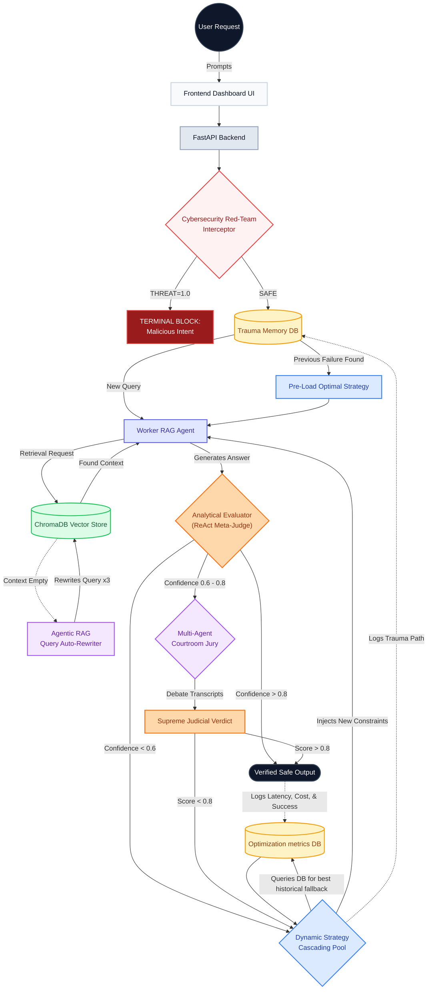

# AegisAI - Full Systems Architecture Diagram

```mermaid
graph TD
    %% Base Infrastructure
    User((User Request)):::user
    UI[Frontend Dashboard UI]:::ui
    API[FastAPI Backend]:::api
    
    %% Security Layer
    Firewall{"Cybersecurity Red-Team \nInterceptor"}:::security
    Block[TERMINAL BLOCK: \nMalicious Intent]:::error
    
    %% Memory Layer
    Trauma[(Trauma Memory DB)]:::memory
    Experience[(Optimization metrics DB)]:::memory
    
    %% RAG Core
    PreLoad[Pre-Load Optimal Strategy]:::strategy
    Worker[Worker RAG Agent]:::core
    Chroma[(ChromaDB Vector Store)]:::db
    AgenticRAG[Agentic RAG \nQuery Auto-Rewriter]:::agentic
    
    %% Evaluators
    Evaluator{"Analytical Evaluator\n(ReAct Meta-Judge)"}:::evaluator
    Courtroom{"Multi-Agent \nCourtroom Jury"}:::agentic
    Supreme[Supreme Judicial Verdict]:::evaluator
    
    %% Strategy Routing
    StrategyPool{Dynamic Strategy \nCascading Pool}:::strategy
    
    %% Output
    FinalOutput([Verified Safe Output]):::user

    %% The Flow
    User -->|Prompts| UI
    UI --> API
    API --> Firewall
    
    Firewall -->|THREAT=1.0| Block
    Firewall -->|SAFE| Trauma
    
    Trauma -->|Previous Failure Found| PreLoad
    Trauma -->|New Query| Worker
    PreLoad --> Worker
    
    Worker -->|Retrieval Request| Chroma
    Chroma -.->|Context Empty| AgenticRAG
    AgenticRAG -->|Rewrites Query x3| Chroma
    Chroma -->|Found Context| Worker
    
    Worker -->|Generates Answer| Evaluator
    
    Evaluator -->|Confidence > 0.8| FinalOutput
    Evaluator -->|Confidence 0.6 - 0.8| Courtroom
    Evaluator -->|Confidence < 0.6| StrategyPool
    
    Courtroom -->|Debate Transcripts| Supreme
    Supreme -->|Score > 0.8| FinalOutput
    Supreme -->|Score < 0.8| StrategyPool
    
    StrategyPool -->|Queries DB for best historical fallback| Experience
    Experience --> StrategyPool
    StrategyPool -->|Injects New Constraints| Worker
    
    FinalOutput -.->|Logs Latency, Cost, & Success| Experience
    StrategyPool -.->|Logs Trauma Path| Trauma

    %% Styling 
    classDef user fill:#0f172a,stroke:#334155,stroke-width:2px,color:#fff;
    classDef ui fill:#f8fafc,stroke:#cbd5e1,stroke-width:2px,color:#0f172a;
    classDef api fill:#e2e8f0,stroke:#94a3b8,stroke-width:2px,color:#0f172a;
    classDef security fill:#fef2f2,stroke:#ef4444,stroke-width:2px,color:#991b1b;
    classDef error fill:#991b1b,stroke:#ef4444,stroke-width:2px,color:#fff;
    classDef memory fill:#fef3c7,stroke:#f59e0b,stroke-width:2px,color:#92400e;
    classDef core fill:#e0e7ff,stroke:#6366f1,stroke-width:2px,color:#3730a3;
    classDef db fill:#dcfce7,stroke:#22c55e,stroke-width:2px,color:#166534;
    classDef agentic fill:#f3e8ff,stroke:#a855f7,stroke-width:2px,color:#6b21a8;
    classDef evaluator fill:#fed7aa,stroke:#f97316,stroke-width:2px,color:#9a3412;
    classDef strategy fill:#dbeafe,stroke:#3b82f6,stroke-width:2px,color:#1e40af;
```
