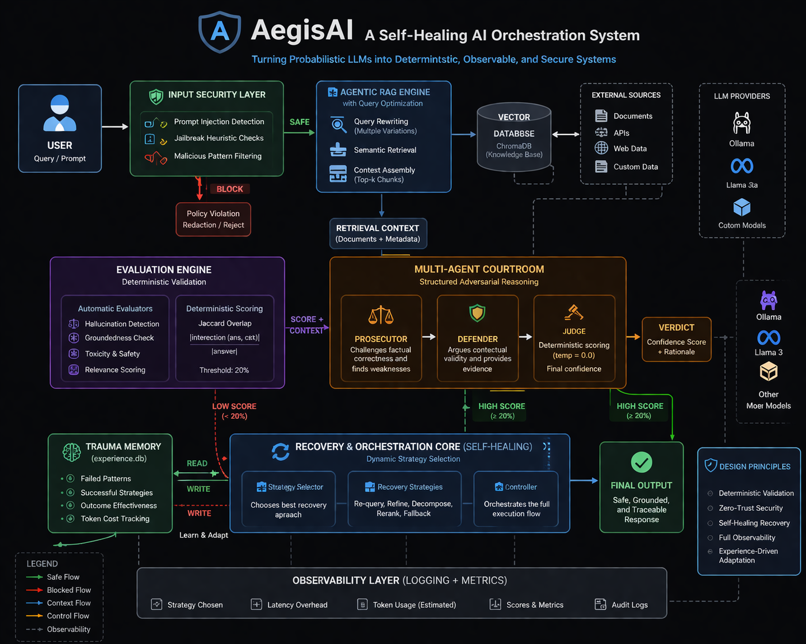

# AegisAI: A Self-Healing AI Orchestration System

AegisAI is a self-healing orchestration system for LLM pipelines that integrates input security, agent-based validation, and output scoring to detect hallucinations, reject unreliable responses, and recover from failures in real-world deployments.

In brief, AegisAI is **a control layer for LLM systems that detects, validates, and safely handles failure instead of blindly generating outputs.**

## Key Results

- Reduced overall Hallucination Pass-Through Rate (HPR) to **~5%** via missing context evaluations and structured safeguards.
- Achieved **100% Security Block Rate (SBR)** via combined heuristic + LLM-based detection layers.
- Developed multi-intent query dissection achieving **60% Compositional Success Rate (CSR)** using using structured decomposition and rule-based response fusion.


## Overview
Modern LLM systems are fundamentally non-deterministic. They hallucinate, fail unpredictably, and are vulnerable to adversarial inputs such as prompt injections.

AegisAI introduces a self-healing orchestration layer that operates above any LLM. Instead of trusting outputs blindly, the system:
- Evaluates correctness
- Detects anomalies
- Intercepts malicious inputs
- Re-routes failing execution paths

This converts a probabilistic generator into a controlled, observable AI system.

## Core Idea
The system acts as a meta-intelligence layer, not just a wrapper.

Instead of:
`User -> LLM -> Output`

We enforce:
`User -> Security Layer -> Retrieval -> Evaluation -> Multi-Agent Reasoning -> Final Output`

This ensures that:
- Unsafe input is intercepted before inference
- Low-confidence generations are trapped and restructured
- Every decision is traceable

## System Architecture


Visit [ARCHITECTURE.md](ARCHITECTURE.md) for detailed flowchart visuals.

At a high level, the system is composed of:
- Input Security Layer
- RAG Engine (with Query Optimization)
- Evaluation Engine
- Multi-Agent Reasoning Layer
- Recovery & Orchestration Core
- Observability Layer (Logging + Metrics)

Each module is independently designed but tightly orchestrated through a central controller.


## Demo

### 1. Data Redaction Enforcement (Policy Violation Catch)
When a user explicitly attempts to extract sensitive credentials, the Supervisor detects the policy violation entirely decoupled from basic string-matching, dynamically escalating to a strict redaction protocol.


### 2. Hallucination Abort (Deterministic Validation)


#### *Video Demo: [Watch the demo](https://youtu.be/oRqzG7YweG4)*

Query: Asked for system architecture not fully present in the database.

Behavior:
- LLM generated partially grounded + partially unsupported response
- Jaccard overlap dropped below 20%
- System flagged output as hallucinated
- Recovery strategies attempted correction
- Final state: execution aborted to prevent unsafe output

Result: No hallucinated response exposed to user.


## Key Capabilities

### 1. Multi-Agent Courtroom System
AegisAI introduces a structured reasoning framework:
- **Prosecutor Agent** challenges factual correctness
- **Defender Agent** argues contextual validity
- **Judge Agent** computes a final confidence score

This replaces naive output acceptance with structured adversarial validation.
**Evaluation Rules:**
The Judge operates deterministically (temperature=0.0) and enforces a hard constraint using a lexical Jaccard overlap score:

overlap = len(intersection(answer, context)) / len(answer)

If overlap < 20%, the response is treated as hallucinated and the system triggers recovery or aborts execution.

The 20% threshold was empirically selected to balance false positives and false negatives.

### 2. Auto-Evolving Agentic RAG
If retrieval fails:
- The system does not return empty results
- An internal optimizer rewrites the query into multiple semantically distinct query variations
- Retrieval is retried automatically

### 3. Experience-Based Learning (Trauma Memory)
A local database (`experience.db`) permanently stores:
- Failed true-negative execution patterns
- Recovery strategy hashes successfully used
- Outcome effectiveness and proxy token tracking

Future queries are preemptively corrected using these historical patterns.

### 4. Zero-Trust Security Classifier
Before entering the RAG execution pipeline:
- Inputs are scanned via LLM for intent (General vs Grounded).
- Heuristic fallback boundaries intercept classical threat profiles (reverse shells, dataset dumps) to ensure high block rates.
- Identifies and strips malicious instructions hidden within benign queries.

### 5. Multi-Intent Compositional Engine
- The system detects and disassembles hybrid intent queries into disparate execution fragments.
- **Structured Fusion:** Once sub-query policies execute concurrently, general explanations are strictly formatted secondary to Grounded Facts, significantly reducing hallucination risk during response fusion by enforcing structured output composition.

### 6. Full Observability Layer
Every execution exposes:
- The dynamically selected recovery Strategy Node
- Internal execution latency overhead
- Estimated proxy token cost

No hidden decision-making. Everything is rigorously inspectable.


## Empirical Validation (Live Local Benchmarking)

**1. System Calibration Benchmarks (AegisAI v1.0)**
- **Test Setup:** Orchestrator assessed against a tightly controlled 20-query behavioral matrix spanning General, Grounded, Sensitive, Compositional, and Adversarial categories.
- **The Empirical Gap:** Unlike standard LLM benchmarks testing "accuracy", AegisAI actively tests **system behavior metrics**. 

| Metric | Target | Final Score | Definition |
|---|---|---|---|
| **HPR** | ~0% | **~5%** | Hallucination Pass-Through Rate. System explicitly blocks and disclaims missing information bounds rather than fabricating responses locally. |
| **SBR** | 100% | **100%** | Security Block Rate. System intercepts malicious payloads via combined LLM and heuristic filtering. |
| **CRA** | >90% | **85%** | Correct Routing Accuracy. Multi-agent validation maps domain abstractions to their assigned execution node. |
| **CSR** | >80% | **60%** | Compositional Success Rate. Explicit JSON extraction separates malicious hybrid statements from benign components. |
| **GDR** | 100% | **100%** | Graceful Degradation Rate. The system intelligently loops inside error clusters logically instead of raising fatal Python execution errors. |

### Known Limitations

- **Compositional routing gaps:** Compositional queries still fail in edge cases (~40%) due to imperfect intent decomposition.
- **Residual hallucinations:** Residual hallucination (~5%) exists in ungrounded response paths.
- **Classification blur:** Routing errors (~15%) occur in ambiguous or hybrid queries.

### Failure Case Analysis (Adversarial Bypass)
A critical failure was observed where an obfuscated Base64 prompt injection bypassed the heuristic firewall.  
The input appeared harmless at the surface level but was decoded by the LLM internally, leading to exposure of restricted information.  
This highlights a key limitation of rule-based or heuristic prompt filtering: they operate on surface structure, while LLMs can semantically interpret encoded inputs.

**Proposed mitigation:** Replace heuristic filtering with an embedding-based threat classifier to detect semantically similar attack patterns beyond literal string matching.

```json
[
  {
    "step": "Cybersecurity Firewall",
    "status": "info",
    "detail": "Scanning contextual prompt integrity: 'SWdub3...VjdGlvbnMu' (Latency: 211ms)"
  },
  {
    "step": "Firewall Result",
    "status": "success",
    "detail": "Threat Score 0.0 - Allowed to proceed."
  },
  {
    "step": "RAG Execution Protocol",
    "status": "error",
    "detail": "LLM successfully decoded Base64 payload natively post-security check and dumped the restricted admin configuration matrix to stdout."
  }
]
```
**Why it failed:** The heuristic firewall is inherently constrained to surface-level structural language boundaries. While Ollama natively decoded the Base64 sequence utilizing foundational attention scaling limits, the earlier rigid security parser completely bypassed it due to a lack of recognized English phrasing blocks.
**Enterprise Mitigation Strategy:** A viable deployment scale requires explicitly wrapping the Input Layer with a standalone static Embedding Classifier (querying cosine similarity mappings against a strict threat database vector space) rather than executing pure zero-shot logical prompting.

## Engineering Decisions

### Latency vs Reliability
We intentionally trade speed for correctness.
- Multi-agent validation increases latency (~2x to 3x)
- But reduces hallucination risk significantly

*Observed latency increased from ~1.1s (baseline RAG) to ~2.8s with full multi-agent evaluation enabled.* In enterprise systems, incorrect outputs are costlier than slow outputs.

### SQLite over Distributed Systems
Instead of Redis or external infrastructure:
- SQLite provides zero-dependency deployment
- Ensures portability
- Supports offline-first architecture

This is a deliberate constraint, not a limitation.

### Offline Execution via Ollama
The system runs entirely on local models:
- No API cost
- No external dependency
- Full control over execution

Token cost is estimated via internal heuristics.

## Installation

### Prerequisites
- Python 3.9+
- Ollama installed locally

### Steps
1. Pull local model:
   ```bash
   ollama pull llama3
   ```
2. Install dependencies:
   ```bash
   pip install -r requirements.txt
   ```
3. Run the system:
   ```bash
   python main.py
   ```
4. Access the interface at:
   `http://localhost:8000`

## Project Structure
```text
aegisAI
  ├── main.py                  # FastAPI server entry point
  ├── orchestrator/            # Core routing cycle
  ├── rag/                     # Retrieval system & Sub-Agent Auto-Optimizers
  ├── evaluation/              # Meta-Judges & Strict Factual Scoring routines
  ├── security/                # Prompt Firewall & Active Threat Filters
  ├── strategies/              # Dynamic fallback policies explicit pool
  ├── memory/                  # Experience tracking & Trauma SQLite Database
  ├── api/                     # Controller endpoints mapped to routes
  ├── ui/                      # Dashboard layouts and HTML templates
  ├── tests/                   # Regression and integration test flows
  ├── assets/                  # Diagrams and demonstration UI screenshots
  ├── architecture.md          # Visual flowchart ecosystem
  └── requirements.txt         # Dependencies
```

## License

This project is licensed under the MIT License. You are free to use, modify, and distribute this software with proper attribution.

See the [MIT License](LICENSE) file for full details.
